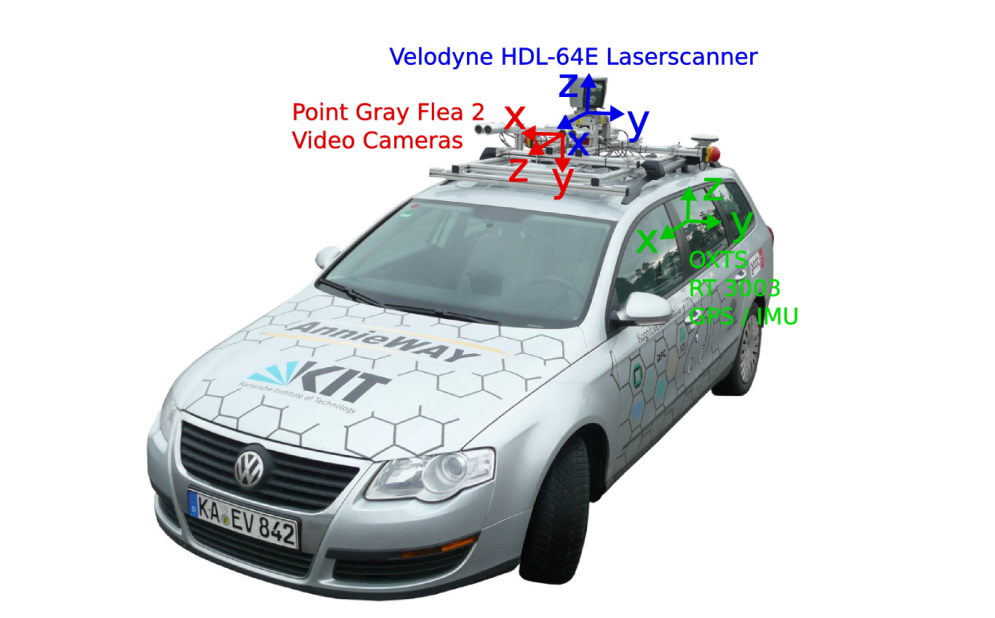
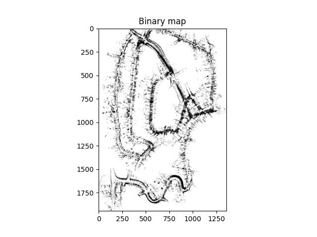
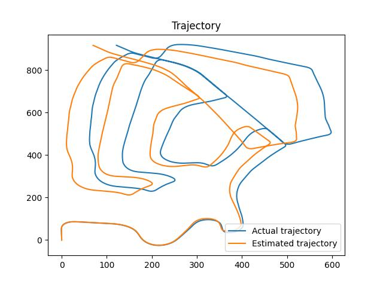
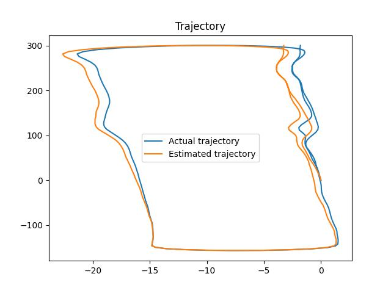
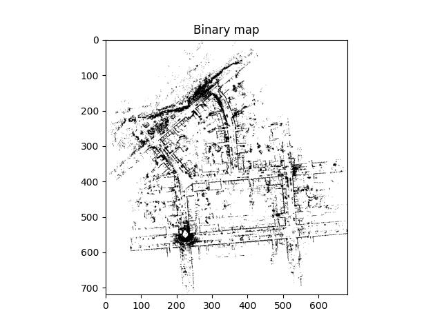
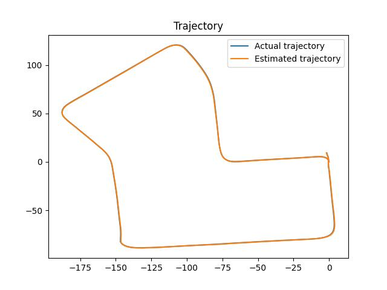
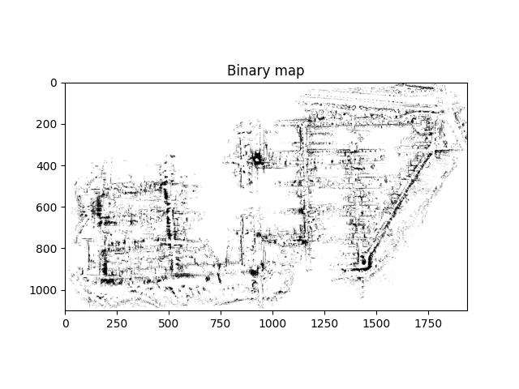
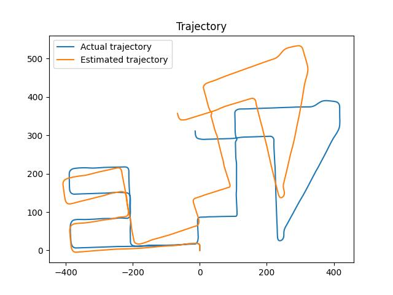

# Particle Filter-based SLAM

Implementation of a Particle Filter-based SLAM for 3D data from an autonomous driving platform (Annieway), which has a Velodyne HDL-64E laser scanner mounted on the roof.

  

## Results

Map             |  Trajectory
:-------------------------:|:-------------------------:
  |  
  |  
  |  
  |  
